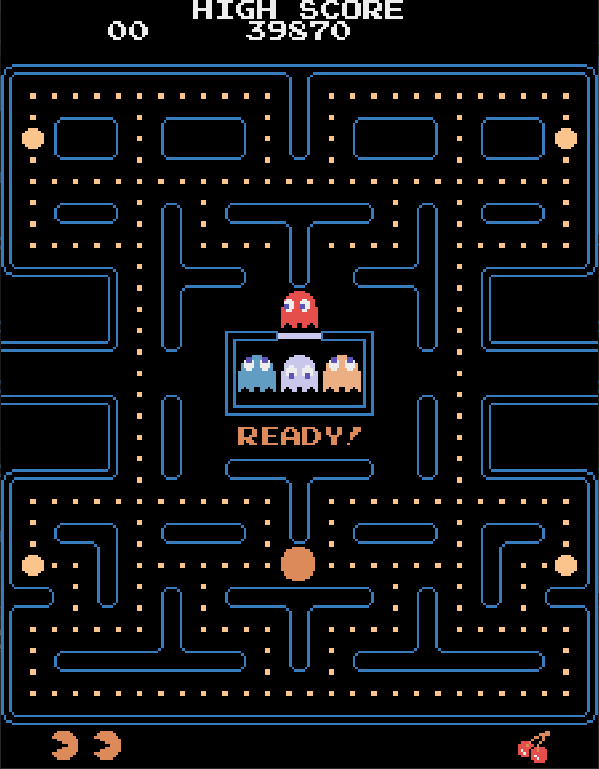

# Pacman Game

This project is a simple implementation of the classic Pacman game using the Godot game engine (4.2) with C# scripting.



## Getting Started

To play the game:

1. **Download the repository:**
    ```bash
    git clone https://github.com/Flyboy1010/GodotPacman.git
    ```

2. **Download Godot Engine:**
   - Download the .NET version of Godot Engine from [godotengine.org](https://godotengine.org/).

3. **Open the project in Godot:**
   - Launch Godot Engine.
   - Open the project by selecting the project folder.

4. **Run the game:**
   - Open the "GamePostProcessing" scene in Godot.
   - Click the "Play" button in Godot to run the Pacman game.

## How to Play

- **Controls:**
  - Use the arrow keys to navigate Pacman through the maze.
  - Press `R` to restart the game.
  - Press `Alt + Enter` to toggle between fullscreen and windowed mode.
